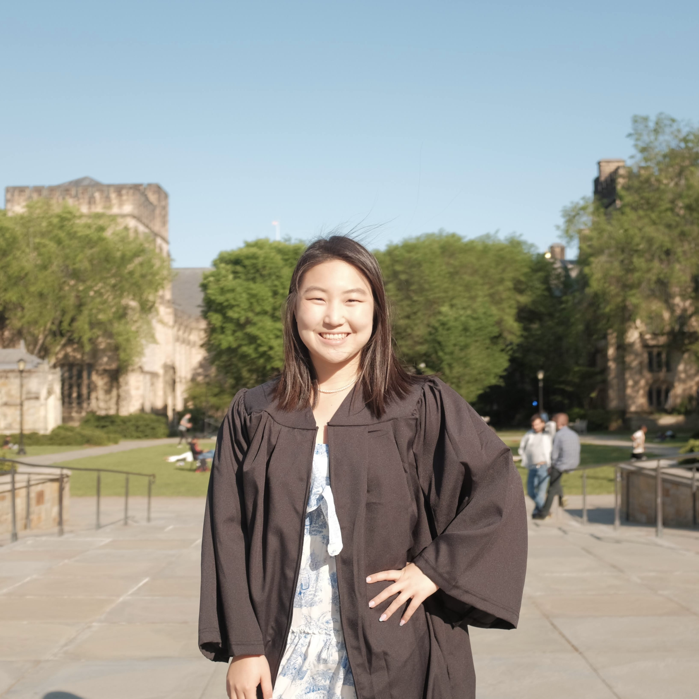

# Chae Young Lee (이채영)

Ph.D. Candidate, Computer Science  
Stanford University  
[Email](mailto:chae@stanford.edu) | [LinkedIn](https://www.linkedin.com/in/cylee-cs/) | [GitHub](https://github.com/chaeyoung-lee)
[Publications](#publications) | [CV](/assets/cv.pdf)

<!-- Headshot floats to the right -->

## About Me

I am a second-year Ph.D. candidate in Computer Science at Stanford, co-advised by Professors [Zerina Kapetanovic](https://www.zerinakapetanovic.com/) and [Sara Achour](https://www.sara-achour.me/). My research interest is in energy-efficient machine learning and mobile embedded systems.

Before Stanford, I received a B.S. in Electrical Engineering & Computer Science at Yale, where I worked with Professor [Lin Zhong](http://www.linzhong.org/) on 5G Cloud RAN.

## Publications

### Conference Proceedings

- [CLEval: Character-Level Evaluation for Text Detection and Recognition Task](https://openaccess.thecvf.com/content_CVPRW_2020/html/w34/Baek_CLEval_Character-Level_Evaluation_for_Text_Detection_and_Recognition_Tasks_CVPRW_2020_paper.html)  
  Youngmin Baek, Daehyun Nam, Sungrae Park, Junyeop Lee, Seung Shin, Jeonghun Baek, **Chae Young Lee**, Hwalsuk Lee  
  *CVPR Text and Documents in the Deep Learning Era Workshop*, 2020  
  [Code](https://github.com/clovaai/CLEval)

- [TedEval: A Fair Evaluation Metric for Scene Text Detectors](https://arxiv.org/abs/1907.01227)  
  **Chae Young Lee**, Youngmin Baek, Hwalsuk Lee  
  *ICDAR Workshop on Industrial Applications of Document Analysis and Recognition*, 2019  
  [Code](https://github.com/clovaai/TedEval) | [Slides](https://docs.google.com/presentation/d/1EFK_WjpdLExZVDPt4C7yCcxjpXNvIyAOL9zUnKx1VoY/edit#slide=id.p1)

- [Conditional WaveGAN](https://arxiv.org/abs/1809.10636)  
  **Chae Young Lee**, Anoop Toffy, Gue Jun Jung, Woo-Jin Han  
  *TensorFlow Korea Conference*, 2018  
  [Code](https://github.com/chaeyoung-lee/cwavegan) | [Slides](https://github.com/chaeyoung-lee/cwavegan/blob/master/final_presentation/CWaveGAN_DLJeju18ppt_Anoop_CY.pdf) | [Blog](https://medium.com/@chaeyoung.lee/conditional-wavegan-explained-1c2a87e8d84d)

### Other Publications

- Diagnosis Method and Apparatus for Neurodegenerative Diseases Based on Deep Learning Network  
  **Chae Young Lee**  
  *Korea Patent (KR 1019363020000)*, 2019
